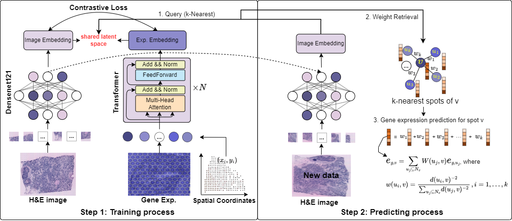

# Multimodal contrastive learning for spatial gene expression prediction using histology images

In this study, we propose mclSTExp: a multimodal deep learning approach utilizing Transformer and contrastive learning architecture. Inspired by the field of natural language processing, we regard the spots detected by ST technology as ''words'' and the sequences of these spots as ''sentences'' containing multiple ''words''. We employ a self-attention mechanism to extract features from these ''words'' and combine them with learnable position encoding to seamlessly integrate the positional information of these ''words''. Subsequently, we employ a contrastive learning framework to fuse the combined features with image features. we employed two human breast cancer datasets and one human cutaneous squamous cell carcinoma (cSCC) dataset. Our experimental results demonstrate that mclSTExp accurately predicts gene expression in H\&E images at different spatial resolutions. This is achieved by leveraging the features of each spot, its spatial information, and H\&E image features. Additionally, mclSTExp demonstrates the ability to interpret specific cancer-overexpressed genes, immunologically relevant genes, preserve the original gene expression patterns, and identify specific spatial domains annotated by pathologists.

## System environment
Required package:
- PyTorch >= 2.1.0
- scanpy >= 1.8
- python >=3.9

## Datasets
Three publicly available ST datasets were used in this study. You can download them from https://zenodo.org/records/13117873 or find them on the following websites：
-  human HER2-positive breast tumor ST data from https://github.com/almaan/her2st/.
-  human cutaneous squamous cell carcinoma 10x Visium data from GSE144240.
-  10x Genomics Visium data and Swarbrick’s Laboratory Visium data from https://doi.org/10.48610/4fb74a9.

## mclSTExp pipeline

- Run `hvg_her2st.py` generation of highly variable genes.
- Run `train.py`
- Run `evel.py`
- Run `tutorial.ipynb`

## Cite
Wenwen Min*, Zhiceng Shi, Jun Zhang, Jun Wan, and Changmiao Wang. "Multimodal contrastive learning for spatial gene expression prediction using histology images." arXiv preprint arXiv:2407.08216 (2024).

## Contact details

zhicengshi@qq.com

wenwen.min@qq.com
